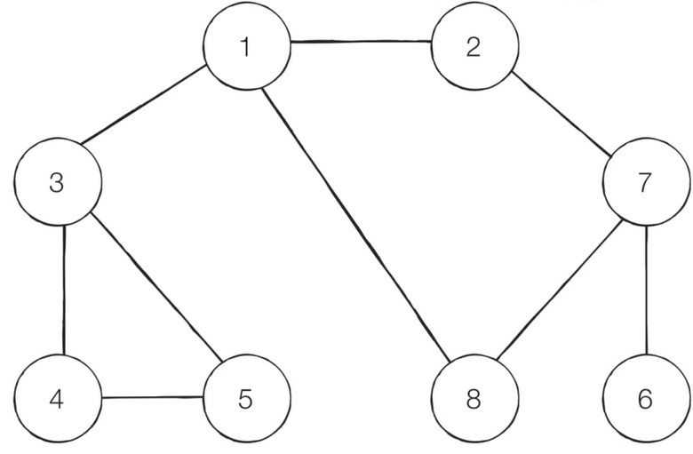
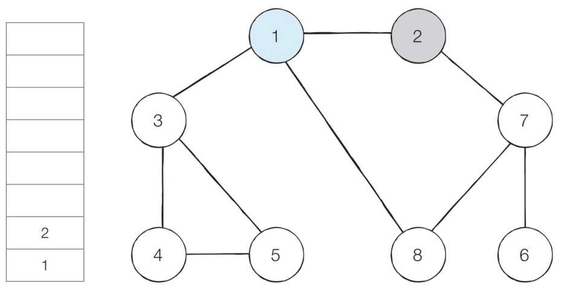
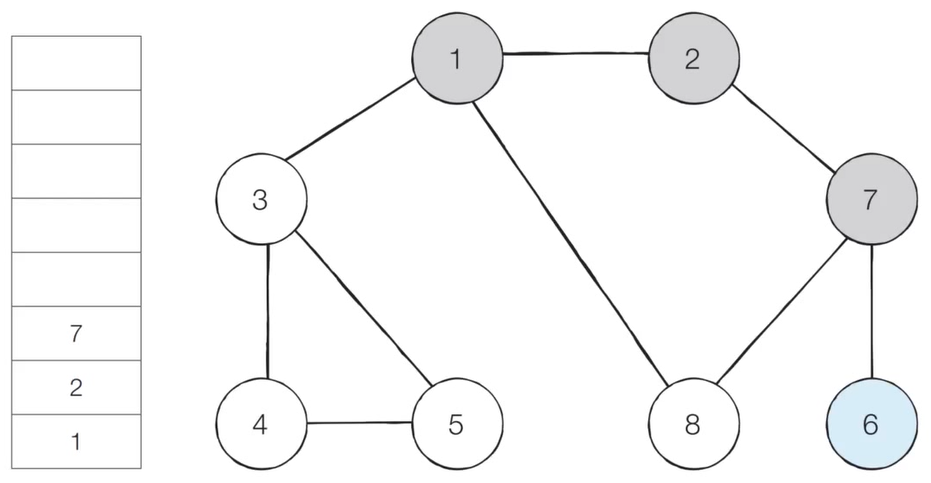
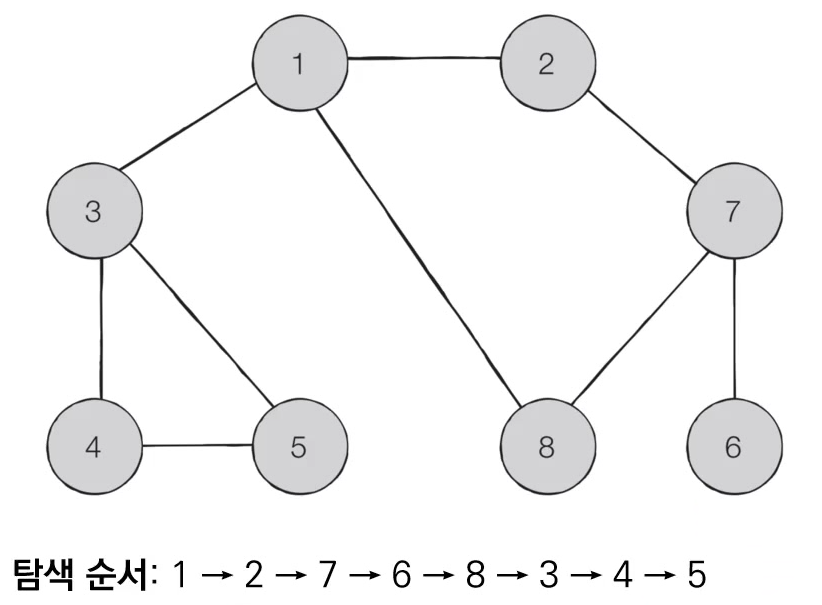
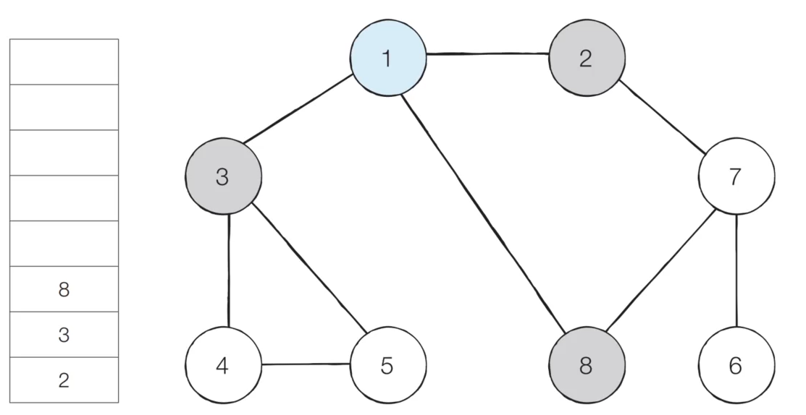
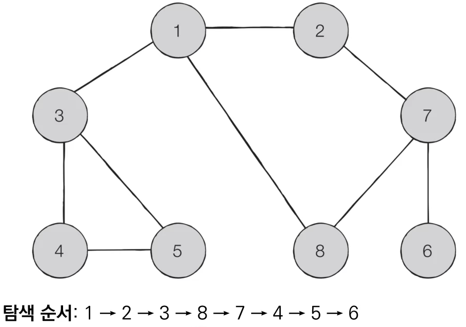

# DFS(Depth-First Search)
- DFS는 깊이 우선 탐색이라고도 부르며 그래프에서 깊은 부분을 우선적으로 탐색하는 알고리즘
- DFS는 스택 자료구조(혹은 재귀 함수)를 이용함
  1. 탐색 시작 노드를 스택에 삽입하고 방문 처리
  2. 스택의 최상단 노드에 방문하지 않은 인접한 노드가 하나라도 있으면 그 노드를 스택에 넣고 방문 처리함. 방문하지 않은 인접 노드가 없으면 스택에서 최상단 노드를 꺼냄
  3. 더 이상 2번의 과정을 수행할 수 없을 때까지 반복

## 동작 예시

1. 그래프 준비 (여기서는 방문 기준 : 번호가 낮은 인접 노드부터)
  - 시작 노드 : 1
2. 스택의 최상단 노드인 '1'에 방문하지 않은 인접 노드 '2','3','8' 중 가장 작은 노드인 '2'를 스택에 넣고 방문 처리

3. 스택의 최상단 노드인 '2'에 방문하지 않은 인접 노드 '7'을 스택에 넣고 방문 처리
4. 스택의 최상단 노드인 '7'에 방문하지 않은 인접 노드 '6', '8' 중 가장 작은 노드인 '6'을 스택에 넣고 방문 처리
5. 스택의 최상단 노드인 '6'에 방문하지 않은 인접 노드가 없으므로 스택에서 '6' 노드를 꺼냄

6. 스택의 최상단 노드인 '7'에 방문하지 않은 인접 '8'을 스택에 넣고 방문 처리
-전체 노드의 탐색 순서(스택에 들어간 순서)


```python
# DFS 메서드 정의
def dfs(graph, v, visited):
  # 현재 노드를 방문 처리
  visited[v] = True
  print(v, end=' ')
  # 현재 노드와 연결된 다른 노드를 재귀적으로 방문
  for i in graph[v]:
    if not visited[i]:
      dfs(graph, i, visited)

# 각 노드가 연결된 정보를 표현(2차원 리스트)
graph = [
  [], # 보통 문제에서는 1번부터 시작하므로 0번 리스트는 비워둠
  [2,3,8], # 1번 노드와 인접한 노드는 2,3,8
  [1,7], # 2번 노드와 인접한 노드는 1,7
  [1,4,5],
  [3,5],
  [3,4],
  [7],
  [2,6,8],
  [1,7] # 8번 노드
]

# 각 노드가 방문된 정보를 표현 (1차원 리스트)
# 아직 방문하지 않았기 때문에 전부 False인덱스 
# 0은 사용하지 않기 위해 하나 더 크게. 코드 상에서 -1씩 하는 방법도 있지만 더 직관적으로 하는 방법
visited = [False] * 9 

# 정의된 DFS 함수 호출
dfs(graph, 1, visited)
```

# BFS(Breadth-First Search)
- BFS는 너비 우선 탐색이라고도 부르며, 그래프에서 가까운 노드부터 우선적으로 탐색하는 알고리즘
- 큐 자료구조를 이용.
1. 탐색 시작 노드를 큐에 삽입하고 방문 처리
2. 큐에서 노드를 꺼낸 뒤에 해당 노드의 인접 노드 중에서 방문하지 않은 노드를 모두 큐에 삽입하고 방문 처리
3. 더 이상 2번의 과정을 수행할 수 없을 때까지 반복
- 특정 조건에서의 최단 경로를 해결하기 위해 사용

## BFS 동작 예시
1. 그래프 준비 (방문 기준 : 번호가 낮은 인접 노드부터)
- 시작노드 : 1

2. 시작 노드인 '1'을 큐에 삽입하고 방문 처리
3. 큐에서 노드 '1'을 꺼내 방문하지 않은 인접 노드 '2', '3', '8'을 큐에 삽입하고 방문 처리

4. 큐에서 노드 '2'을 꺼내 방문하지 않은 인접 노드 '7'을 큐에 삽입하고 방문 처리
5. 큐에서 노드 '3'을 꺼내 방문하지 않은 인접 노드 '4', '5'를 큐에 삽입하고 방문 처리
6. 큐에서 노드 '8'을 꺼내고 방문하지 않은 인접 노드가 없으므로 무시
- 전체 노드의 탐색 순서(큐에 들어간 순서)


```python
from collections import deque

# BFS 메서드 정의
def bfs(graph, start, visited):
  # 큐 (queue) 구현을 위해 deque 라이브러리 사용
  queue = deque([start])
  # 현재 노드를 방문 처리
  visited[start] = True
  # 큐가 빌 때까지 반복
  while queue:
    # 큐에서 하나의 원소를 뽑아 출력하기
    v = queue.popleft()
    print(v, end=' ')
    # 아직 방문하지 않은 인접한 원소들을 큐에 삽입
    for i in graph[v]:
      if not visited[i]:
        queue.append(i)
        visited[i] = True

graph = [
  [], 
  [2,3,8],
  [1,7],
  [1,4,5],
  [3,5],
  [3,4],
  [7],
  [2,6,8],
  [1,7]
]

# 각 노드가 방문된 정보를 표현 (1차원 리스트)
visited = [False] * 9 

# 정의된 BFS 함수 호출
bfs(graph, 1, visited)

```