# 최단 경로 문제
- 최단 경로 알고리즘은 가장 짧은 경로를 찾는 알고리즘
- 다양한 문제 상황
  - 한 지점에서 다른 한 지점까지의 최단 경로
  - 한 지점에서 다른 모든 지점까지의 최단 경로
  - 모든 지점에서 다른 모든 지점까지의 최단 경로
- 각 지점은 그래프에서 노드로 표현
- 지점 간 연결된 도로는 그래프에서 간선을 표현
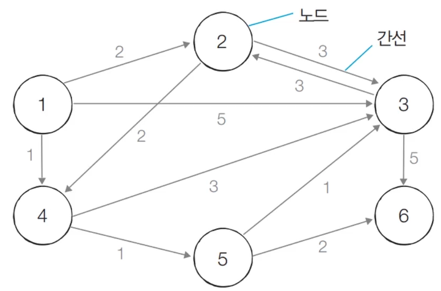

# 다익스트라 최단 경로 알고리즘
- 특정한 노드에서 출발하여 다른 모든 노드로 가는 최단 경로를 계산
- 다익스트라 최단 경로 알고리즘은 음의 간선이 없을 때 정상적으로 동작
  - 현실 세계에서는 음의 간선이 없으므로 현실 세계에 적용 가능
- 다익스트라 최단 경로 알고리즘은 그리디 알고리즘으로 분류
  - 매 상황에서 가장 비용이 적은 노드를 선택해 임의의 과정을 반복
- 기본적으로 최단 경로 알고리즘은 DP로 분류

## 동작 과정
1. 출발 노드를 설정
2. 최단 거리 테이블을 초기화
  - 처음에는 모든 모드로 가는 비용을 무한을 설정
  - 자기 자신은 0으로 설정
3. 방문하지 않은 노드 중에서 최단 거리가 가장 짧은 노드를 선택
4. 해당 노드를 거쳐 다른 노드로 가는 비요을 계산하여 최단 거리 테이블 갱신
5. 3번과 4번을 반복

- 알고리즘 동작 과정에서 최단 거리 테이블은 각 노드에 대한 현재까지의 최단 거리 정보를 가지고 있음
- 처리 과정에서 더 짧은 경로를 찾으면 '이제부터는 이 경로가 제일 짧은 경로야'라고 갱신
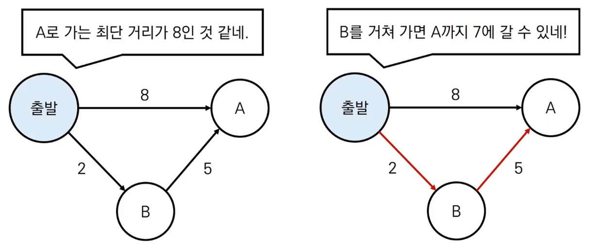

## 예시
0. 그래프를 준비하고 출발 노드를 설정
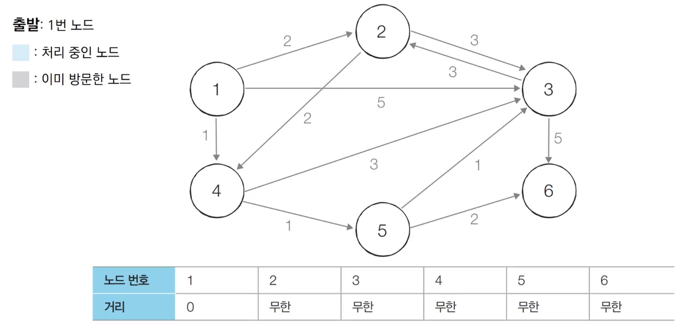
1. 방문하지 않은 노드 중에서 최단 거리가 가장 잛은 노드인 1번 노드를 처리
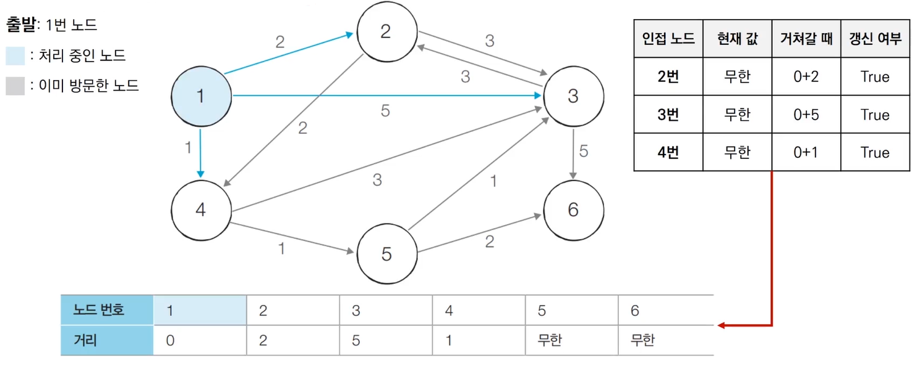
2. 방문하지 않은 노드 중에서 최단 거리가 가장 짧은 노드인 4번 노드를 처리
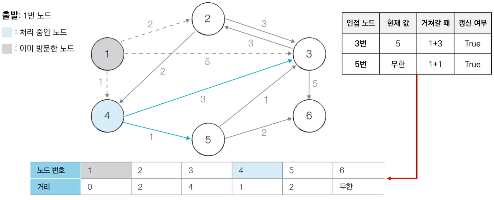
3. 방문하지 않은 노드 중에서 최단 거리가 가장 짧은 노드인 2번 노드를 처리
  - 2번과 5번이 같지만 일반적으로 앞의 번호 먼저 처리
  - 4번의 경우 이미 방문 처리를 했기 때문에 진행을 하지 않을 수도 있음. 방문이 되었다면 최단 경로가 이미 설정되었기 때문
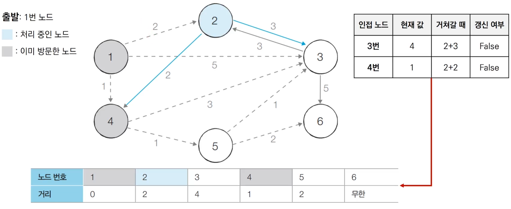
4. 방문하지 않은 노드 중에서 최단 거리가 가장 짧은 노드인 5번 노드를 처리
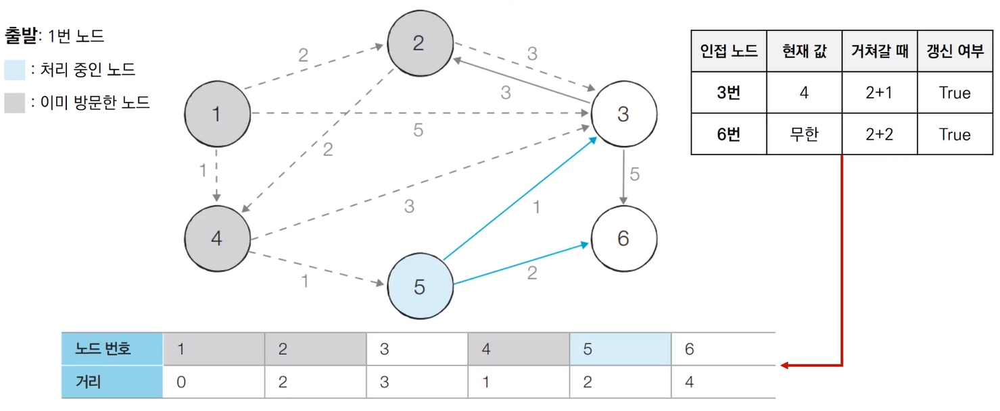
5. 방문하지 않은 노드 중에서 최단 거리가 가장 짧은 노드인 3번 노드를 처리
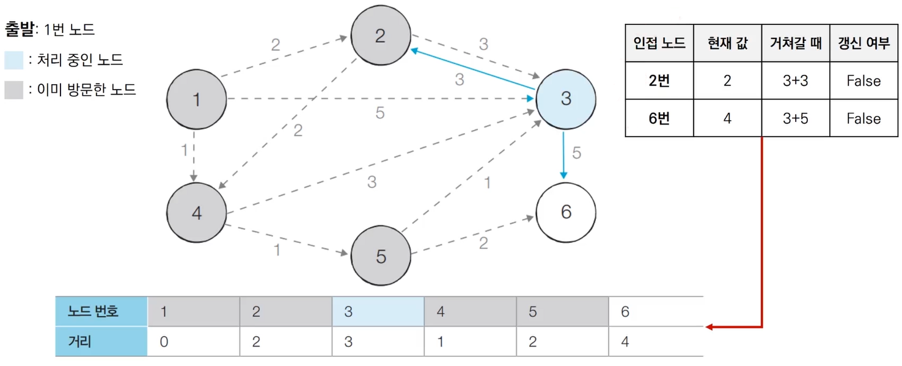
6. 방문하지 않은 노드 중에서 최단 거리가 가장 짧은 노드인 6번 노드를 처리
  - 사실 마지막 노드는 처리하지 않아도 괜찮음
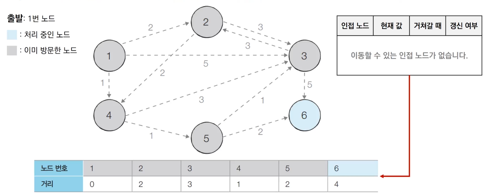

## 특징
- 그리디 알고리즘 : 매 상황에서 방문하지 않은 가장 비용이 적은 노드를 선택해 임의의 과정을 반복
- 단계를 거치며 **한 번 처리된 노드의 최단 거리는 고정**되어 더 이상 바뀌지 않음
  - **한 단계당 하나의 노드에 대한 최단 거리를 확실히 찾는 것으로 이해**
- 다익스트라 알고리즘을 수행한 뒤에 <U>테이블에 각 노드까지의 최단 거리 정보가 저장</U>
  - 완벽한 형태의 최단 경로를 구하려면 소스코드에 추가적인 기능을 넣어야 함

## 간단한 구현 방법 코드
- 단계마다 방문하지 않은 노드 중에서 최단 거리가 가장 짧은 노드를 선택하기 위해 매 단계마다 1차원 테이블의 모든 원소를 확인(순차 탐색)
```python
import sys
input = sys.stdin.readline
INF = int(1e9) # 무한을 의미하는 값으로 10억을 설정

# 노드의 개수, 간선의 개수를 입력받기
n, m = map(int, input().split())
# 시작 노드 번호를 입력받기
start = int(input())
# 각 노드에 연결되어 있는 노드에 대한 정보를 담는 리스트를 만들기
graph = [[] for i in range(n+1)]
# 방문한 적이 있는지 체크하는 목적의 리스트를 만들기
visited = [False] * (n+1)
# 최단 거리 테이블을 모두 무한으로 초기화
distance = [INF] * (n+1)

# 모든 간선 정보를 입력받기
for _ in range(m):
  a,b,c, = map(int, input().split())
  # a번 노드에서 b번 노드로 가는 비용이 c라는 의미
  graph[a].append((b, c))

# 방문하지 않은 노드 중에서, 가장 최단 거리가 짧은 노드의 번호를 반환
def get_smallest_noe():
  min_value = INF
  index = 0 # 가장 최단 거리가 짧은 노드(인덱스)
  for i in range(1, n+1):
    if distance[i] < min_value and not visited[i]:
      min_value = distance[i]
      index = i
  return index

def dijkstra(start):
  # 시작 노드에 대해서 초기화
  distance[start] = 0
  visited[start] = True
  for j in graph[start]:
    distance[j[0]] = j[1]
  # 시작 노드를 제외한 전체 n - 1개의 노드에 대해 반복
  for i in range(n-1):
    # 현재 최단 거리가 가장 짧은 노드를 꺼내서, 방문 처리
    now = get_smallest_node()
    visited[now] = True
  # 현재 노드와 연결된 다른 노드를 확인
    for j in graph[now]:
      cost = distance[now] + j[1]
      # 현재 노드를 거쳐서 다른 노드로 이동하는 거리가 더 짧은 경우
      if cost < distance[j[0]]:
        distance[j[0]] = cost

# 다익스트라 알고리즘을 수행
dijkstra(start)

# 모든 노드로 가기 위한 최단 거리를 출력
for i in range(1, n+1):
  # 도달할 수 없는 경우, 무한이라고 출력
  if distance[i] == INF:
    print('INFINITY')
  # 도달할 수 있는 경우 거리를 출력
  else:
    print(distance[i])
```

## 성능 분석
- 총 O(V)번에 걸쳐 최단 거리가 가장 짧은 노드를 매번 선형 탐색
- 전체 시간 복잡도 O(V^2)
- 일반적으로 코딩 테스트의 최단 경로 문제에서 전체 노드의 개수가 5,000개 이하라면 문제 해결
  - 노드의 개수가 10,000개가 넘는 문제라면? -> 우선 순위 큐

### 우선 순위큐(Priority Queue)
- 우선순위가 가장 높은 뎉이터를 가장 먼제 삭제하는 자료구조
- 대부분의 프로그래밍 언어에서 표준 라이브러리 형태로 지원

### 힙(Heap)
- 우선순위 큐를 구현하기 위해 사용하는 자료구조 중 하나
- 최소 힙과 최대 힙이 있음
- 다익스트라 최단 경로 알고리즘을 포함해 다양한 알고리즘에서 사용됨

```python
# 최소 힙
import heapq 

# 오름차순 힙 정렬(Heap Sort)
def heapsort(iterable):
  h = []
  result = []
  # 모든 원소를 차례대로 힙에 삽입
  for value in iterable: 
    heapq.heappush(h, value)
  # 힙에 삽입된 모든 원소를 차례대로 꺼내어 담기
  for i in range(len(h)):
    result.append(heapq.heappop(h))
  return result

result = heapsort([1,3,5,7,9,2,4,6,8,0])
print(result) # [0,1,2,3,4,5,6,7,8,9]
```

```python
# 최대 힙
import heapq 

# 내림차순 힙 정렬(Heap Sort)
def heapsort(iterable):
  h = []
  result = []
  # 모든 원소를 차례대로 힙에 삽입
  for value in iterable: 
    heapq.heappush(h, -value)
  # 힙에 삽입된 모든 원소를 차례대로 꺼내어 담기
  for i in range(len(h)):
    result.append(-heapq.heappop(h))
  return result

result = heapsort([1,3,5,7,9,2,4,6,8,0])
print(result) # [9,8,7,6,5,4,3,2,1,0]
```

## 개선된 구현 방법
- 단계마다 <U>방문문하지 않은 노드 중에서 최단 거리가 가장 짧은 노드를 선택</U>하기 위해 힙(Heap) 자료구조 이용
- 다익스트라 알고리즘이 동작하는 **기본 원리는 동일**
  - 현재 가장 가까운 노드를 저장해 놓기 위해서 힙 자료구조를 추가적으로 이용
  - 현재의 최단 거리가 가장 짧은 노드를 선택해야 하므로 최소 힙을 사용

## 동작 과정(우선순위 큐)
0. 그래프를 준비하고 출발 노드를 설정하여 우선순위 큐에 삽입
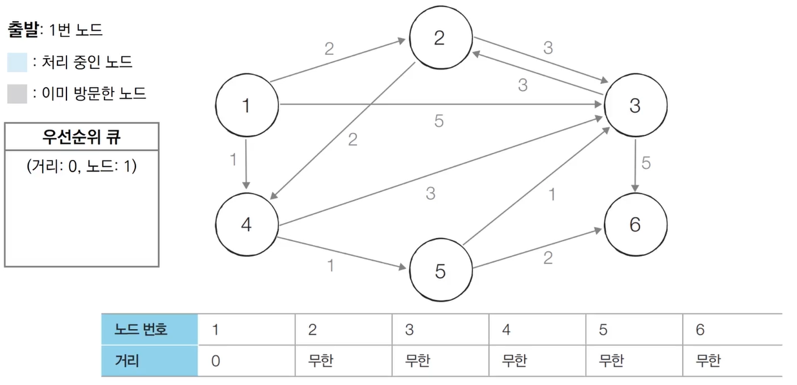
1. 우선순위 큐에서 원소를 꺼냄. 1번 노드는 아직 방문하지 않았으므로 처리
  - 갱신을 한 후 새로 우선 순위 큐에 반영
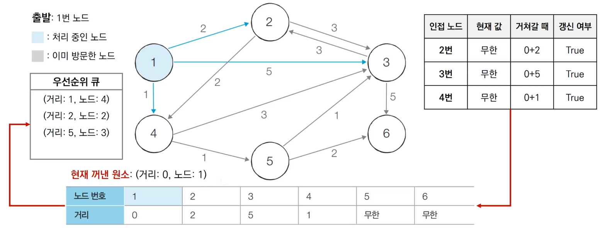
2. 우선순위 큐에서 원소를 꺼냄. 4번 노드는 아직 방문하지 않았으므로 처리
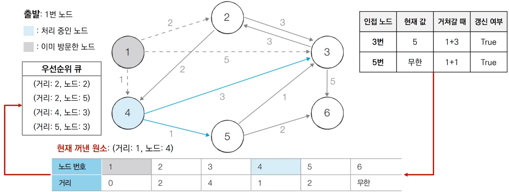
3. 우선순위 큐에서 원소를 꺼냄. 2번 노드는 아직 방문하지 않았으므로 처리
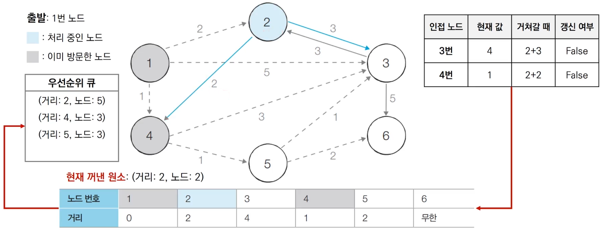
4. 우선순위 큐에서 원소를 꺼냄. 5번 노드는 아직 방문하지 않았으므로 처리
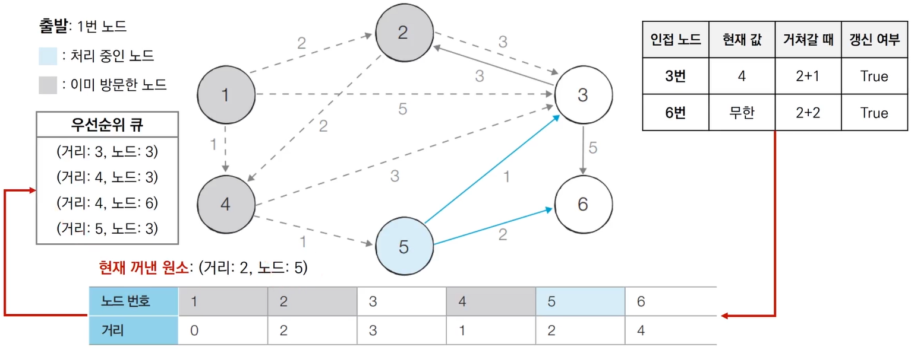
5. 우선순위 큐에서 원소를 꺼냄. 3번 노드는 아직 방문하지 않았으므로 처리
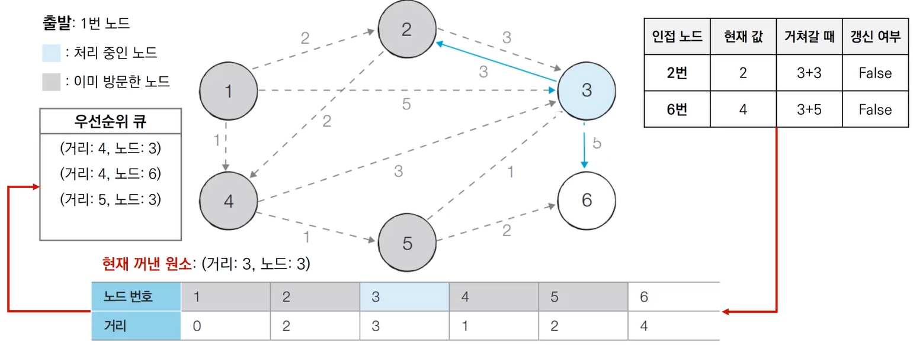                  
6. 우선순위 큐에서 원소를 꺼냄. 3번 노드는 이미 방문했으므로 무시
  - 최단 거리 테이블을 사용해서 현재의 최단 거리보다 크면 무시하는 방법도 사용 가능
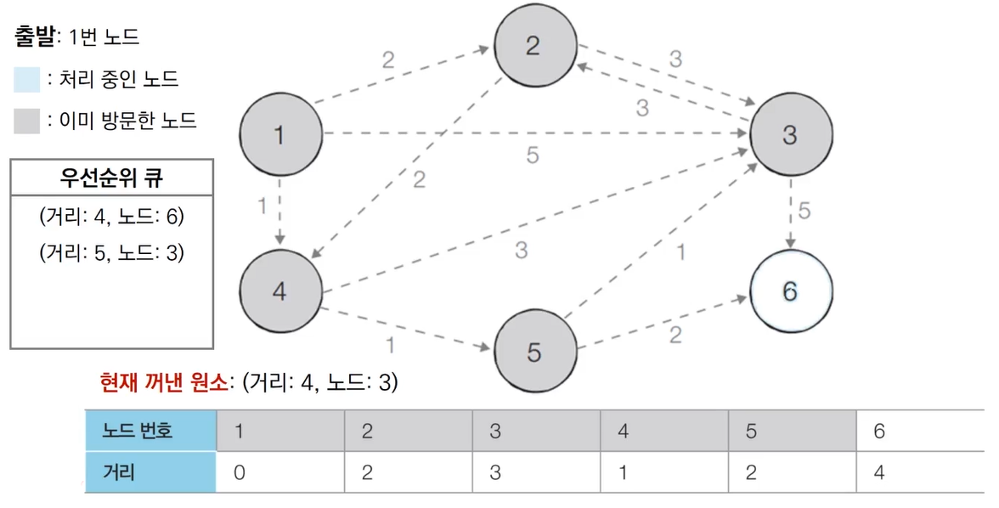
7. 우선순위 큐에서 원소를 꺼냄. 6번 노드는 아직 방문하지 않았으므로 처리
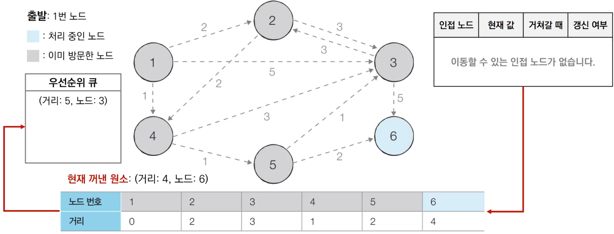
8. 우선순위 큐에서 원소를 꺼냄. 3번 노드는 이미 방문했으므로 무시
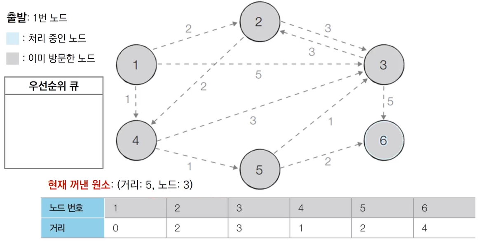

## 개선된 구현 방법 코드
```python
import heapq
import sys
input = sys.stdin.readline
INF = int(1e9) # 무한을 의미하는 값으로 10억을 설정

# 노드의 개수, 간선의 개수를 입력받기
n, m = map(int, input().split())
# 시작 노드 번호를 입력받기
start = int(inpuut())
# 각 노드에 연결되어 있는 노드에 대한 정보를 담는 리스트를 만들기
graph = [[] for i in range(n+1)]
# 방문한 적이 있는지 체크하는 목적의 리스트를 만들기
visited = [False] * (n+1)
# 최단 거리 테이블을 모두 무한으로 초기화
distance = [INF] * (n+1)

# 모든 간선 정보를 입력받기
for _ in range(m):
  a,b,c, = map(int, input().split())
  # a번 노드에서 b번 노드로 가는 비용이 c라는 의미
  graph[a].append((b, c))

def dijkstra(start):
  q = []
  # 시작 노드로 가기 위한 최단 경로는 0으로 설정하여, 큐에 삽입
  heapq.heappush(q, (0, start))
  distance[start] = 0
  while q: # 큐가 비어있지 않다면
    # 최단 거리가 가장 짧은 노드에 대한 정보 꺼내기
    dist, now = heap.heappop(q)
    # 현재 노드가 이미 처리된 적이 있는 노드라면 무시
    if distance[now] < dist:
      continue
    # 현재 노드와 연결된 다른 인접한 노드들을 확인
    for i in graph[now]:
      cost = dist + i[1]
      # 현재 노드를 거쳐서, 다른 노드로 이동하는 거리가 더 짧은 경우
      if cost < distance[i[0]]:
        distance[i[0]] = cost
        heapq.heappush(q, (cost, i[0]))

# 다익스트라 알고리즘을 수행
dijkstra(start)

# 모든 노드로 가기 위한 최단 거리를 출력
for i in range(1, n+1):
  # 도달할 수 없는 경우, 무한이라고 출력
  if distance[i] == INF:
    print('INFINITY')
  # 도달할 수 있는 경우 거리를 출력
  else:
    print(distance[i])
```

## 성능 분석
- 힙 자료구조를 이용하는 다익스트라 알고리즘의 시간 복잡도는 **O(ElogV)**
- 노드를 하나씩 꺼내 검사하는 반복문(while문)은 노드의 개수 V 이상의 횟수로는 처리되지 않음
  - 결과적으로 현재 우선순위 큐에서 꺼낸 노드와 연결된 다른 노드들을 확인하는 총횟수는 최대 간선의 개수(E)만큼 연산이 수행될 수 있음
- 직관적으로 전체 과정은 <U>E개의 원소를 우선순위 큐에 넣었다가 모두 꺼내는 연산과 매우 유사함</U>
  - 시간 복잡도를 O(ElogE)로 판단할 수 있음
  - 중복 간선을 포함하지 않는 경우에 이를 O(ElogV)로 정리
    - O(ElogE) -> O(ElogV^2) -> O(2ElogV) -> O(ElogV)
