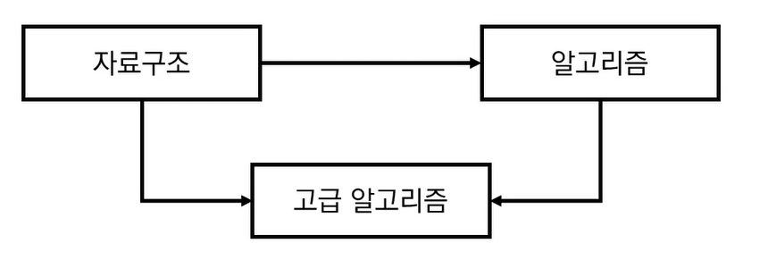
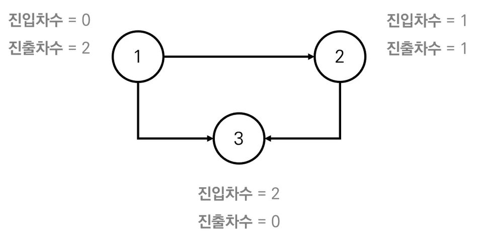
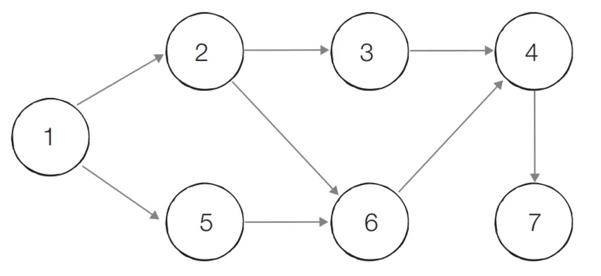
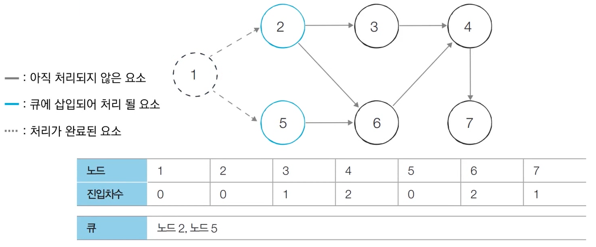
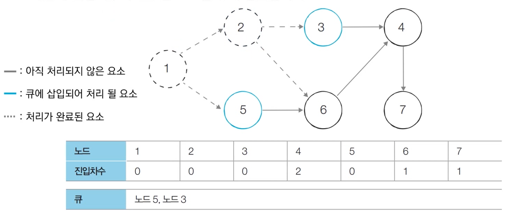
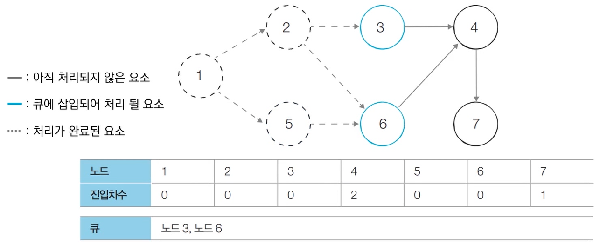
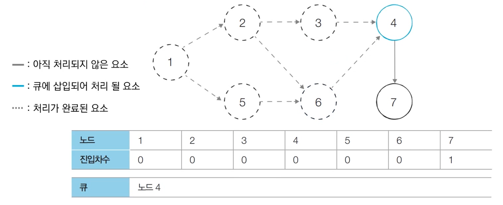

# 위상 정렬
- 사이클이 없는 방향 그래프의 **모든 노드를 방향성에 거스르지 않도록 순서대로 나열**하는 것을 의미
ex) 선수과목을 고려한 학습 순서 설정

  - 위 세 과목을 모두 듣기 위한 적절한 학습 순서는
    - 자료구조 -> 고급 알고리즘 -> 알고리즘 (X)
    - 자료구조 -> 알고리즘 -> 고급 알고리즘 (O)

## 진입차수와 진출차수
- 진입차수(Indegree) : 특정한 노드로 들어오는 간선의 개수
- 진출차수(Outdegree) : 특정한 노드에서 나가는 간선의 개수


## 동작 과정
-  큐를 이용하는 위상 정렬 알고리즘 
1. 진입차수가 0인 모든 노드를 큐에 넣는다.
2. 큐가 빌 때까지 다음의 과정을 반복한다.
  1. 큐에서 원소를 꺼내 해당 노드에서 나가는 간선을 그래프에서 제거
  2. 새롭게 진입차수가 0이 된 노드를 큐에 넣는다.

- 결과적으로 **각 노드가 큐에 들어온 순서가 위상 정렬을 수행한 결과와 같음**

## 동작 예시
0. 위상 정렬을 수행할 그래프(사이클이 없는 방향 그래프(DAG)) 준비

0. 진입차수가 0인 모든 노드를 큐에 넣음
- 노드 1이 큐에 처음 삽입됨

1. 큐에서 노드 1을 꺼낸 뒤에 노드 1에서 나가는 간선을 제거
  - 새롭게 진입차수가 0이 된 노드들을 큐에 삽입

2. 큐에서 노드 2를 꺼낸 뒤에 노드 2에서 나가는 간선을 제거
  - 새롭게 진입차수가 0이 된 노드들을 큐에 삽입

3. 큐에서 노드 5를 꺼낸 뒤에 노드 5에서 나가는 간선을 제거
  - 새롭게 진입차수가 0이 된 노드들을 큐에 삽입

4. 큐에서 노드 3을 꺼낸 뒤에 노드 3에서 나가는 간선을 제거
  - 새롭게 진입차수가 0이 된 노드가 없으므로 넘어감

5. 큐에서 노드 6을 꺼낸 뒤에 노드 6에서 나가는 간선을 제거
  - 새롭게 진입차수가 0이 된 노드가 없으므로 넘어감

6. 큐에서 노드 4를 꺼낸 뒤에 노드 6에서 나가는 간선을 제거
  - 새롭게 진입차수가 0이 된 노드가 없으므로 넘어감

7. 큐에서 노드 7을 꺼낸 뒤에 노드 3에서 나가는 간선을 제거
  - 새롭게 진입차수가 0이 된 노드가 없으므로 넘어감


- 위상 정렬 결과 : 1 -> 2 -> 5 -> 3 -> 6 -> 4 -> 7

## 특징
- **DAG(Direct Acyclic Graph, 순환하지 않는 방향 그래프)**에 대해서만 수행할 수 있음
- **여러 가지 답이 존재할 수 있음**
  - 한 단계에서 큐에 새롭게 들어가는 원소가 2개 이상인 경우
- **모든 원소를 방문하기 전에 큐가 빈다면 사이클이 존재**한다고 판단할 수 있음
  - 사이클에 포함된 원소들은 큐에 들어가지 못함
- 스택을 활용한 DFS를 위용해 위상 정렬을 수행할 수도 있음

## 코드
```python
from collections import deque

# 노드의 개수와 간선의 개수를 입력 받기
v, e = map(int, input().split())
# 모든 노드에 대한 진입차수는 0으로 초기화
indegree = [0] * (v + 1)
# 각 노드에 연결된 간선 정보를 담기 위한 연결 리스트 초기화
graph = [[] for i in range(v + 1)]

# 방향 그래프의 모든 간선 정보를 입력 받기
for _ in range(e):
    a, b = map(int, input().split())
    graph[a].append(b) # 정점 A에서 B로 이동 가능
    # 진입 차수를 1 증가
    indegree[b] += 1

# 위상 정렬 함수
def topology_sort():
    result = [] # 알고리즘 수행 결과를 담을 리스트
    q = deque() # 큐 기능을 위한 deque 라이브러리 사용

    # 처음 시작할 때는 진입차수가 0인 노드를 큐에 삽입
    for i in range(1, v + 1):
        if indegree[i] == 0:
            q.append(i)

    # 큐가 빌 때까지 반복
    while q:
        # 큐에서 원소 꺼내기
        now = q.popleft()
        result.append(now)
        # 해당 원소와 연결된 노드들의 진입차수에서 1 빼기
        for i in graph[now]:
            indegree[i] -= 1
            # 새롭게 진입차수가 0이 되는 노드를 큐에 삽입
            if indegree[i] == 0:
                q.append(i)

    # 위상 정렬을 수행한 결과 출력
    for i in result:
        print(i, end=' ')

topology_sort()
```

## 성능 분석
- 위상 정렬을 위해 모든 노드를 확인하며 각 노드에서 나가는 간선을 차례대로 제거해야 함
  - 시간 복잡도 O(V + E)