# 서로소 집합
- 서로소 집합(Disjoint Sets)란 <U>공통 원소가 없는 두 집합</U>
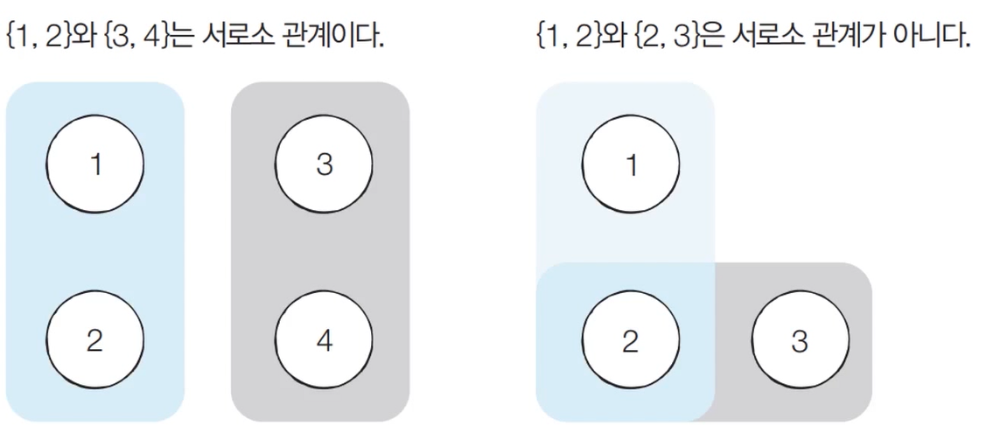

# 서로소 집합 자료구조
- <U>서로소 부분 집합들로 나누어진 원소들의 데이터를 처리하기 위한 자료구조</U>
- 서로소 집합 자료구조는 두 종류의 연산을 지원
  - 합집합(Union) : 두 개의 원소가 포함된 집합을 하나의 집합으로 합치는 연산
  - 찾기(Find) : 특정한 원소가 속한 집합이 어떤 집합인지 알려주는 연산
- 서로소 집합 자료구조는 **합치기 찾기(Union Find) 자료구조**라고 불리기도 함

## 동작 과정
1. 합집합(Union) 연산을 확인하여, 서로 연결된 두 노드 A, B를 확인
  1. A와 B의 루트 노드 A', B'를 각각 찾음
  2. A'를 B'의 부모 노드로 설정
2. 모든 합집합 연산을 처리할 때까지 1번 과정 반복

## 예시
- 처리할 연산들 Union(1,4), Union(2,3), Union(2,4), Union(5,6)
0. 노드의 개수 크기의 부모 테이블을 초기화
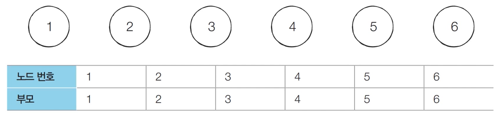
1. 노드 1과 노드 4의 루트 노드를 각각 찾음. 현재 루트 노드는 각각 1과 4이므로 더 큰 번호에 해당하는 루트 노드4의 부모를 1로 설정
  - 더 작은 번호로 설정할 수 있지만 큰 번호를 설정하는 것이 관행
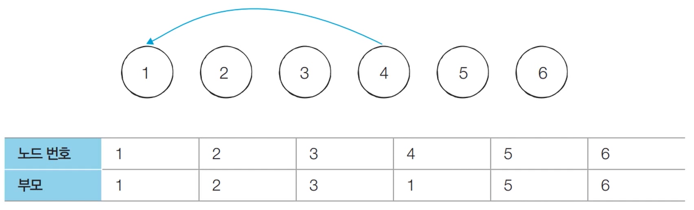
2. 노드 2와 노드 3의 루트 노드를 각각 찾음. 현재 루트 노드는 각각 2와 3이므로 더 큰 번호에 해당하는 루트 노드3의 부모를 2로 설정
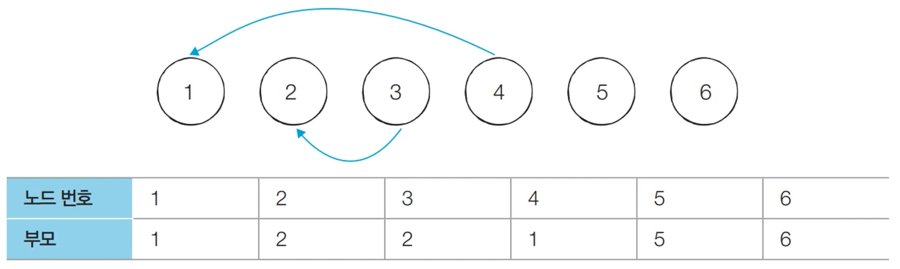
3. 노드 2와 노드 4의 루트 노드를 각각 찾음. 현재 루트 노드는 각각 2와 1이므로 더 큰 번호에 해당하는 루트 노드2의 부모를 1로 설정
  - 아래 보이는 테이블은 부모 테이블이지 루트 테이블이 아님
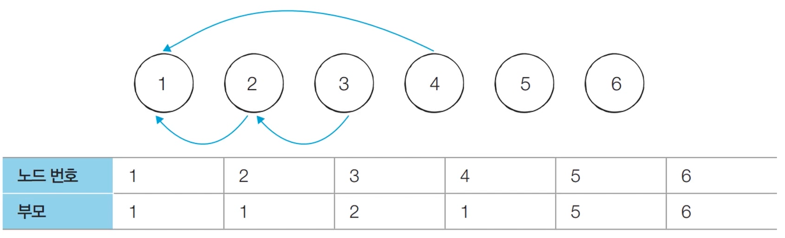
4. 노드 5와 노드 6의 루트 노드를 각각 찾음. 현재 루트 노드는 각각 5와 6이므로 더 큰 번호에 해당하는 루트 노드6의 부모를 5로 설정
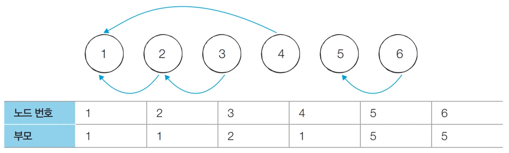

- 연결성을 통해 손쉽게 집합의 형태를 확인할 수 있음
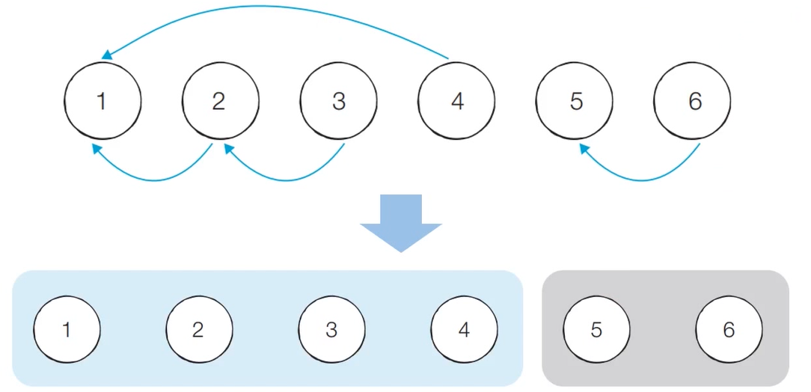

## 연결성
- 기본적인 형태의 서로소 집합 자료구조에서는 루트 노드에 즉시 접근할 수 없음
  - 루트 노드를 찾기 위해 <U>부모 테이블을 계속 확인</U>하여 거슬러 올라가야 함
  - 재귀적으로 접근

## 코드
```python
# 특정 원소가 속한 집합을 찾기
def find_parent(parent, x):
  # 루트 노드를 찾을 때까지 재귀 호출
  if parent[x] != x: 
    return find_parent(parent, parent[x])

# 두 원소가 속한 집합을 합치기 
def union_parent(parent, a, b):
  a = find_parent(parent, a)
  b = find_parent(parent, b):
  if a < b:
    parent[b] = a
  else:
    parent[a] = b
# 노드의 개수와 간선(Union 연산)의 개수 입력 받기
v, e =map(int, input().split())
parent = [0] * (v + 1) # 부모 테이블 초기화하기

# 부모 테이블상에서, 부모를 자기 자신으로 초기화
for i in range(1, v + 1):
  parent[i] = i

# Union 연산을 각각 수행
for i in range(e):
  a, b = map(int, input().split())
  union_parent(parent, a, b)

# 각 원소가 속한 집합 출력하기
print('각 원소가 속한 집합: ', end='')
for i in range(1, v + 1):
  print(find_parent(parent, i), end=' ')

print()

# 부모 테이블 내용 출력하기
print('부모 테이블: ', end='')
for i in range(1, v + 1):
  print(parent[i], end=' ')
```

## 기본적인 구현 방법의 문제점
- 합집합 연산이 편향되게 이루어지는 경우 찾기 함수가 비효율적으로 동작
- 최악의 경우 찾기 함수가 모든 노드를 다 확인하게 되어 시간 복잡도가 O(V)
  - {1,2,3,4,5}와 Union(4,5), Union(3,4), Union(2,3), Union(1,2)
  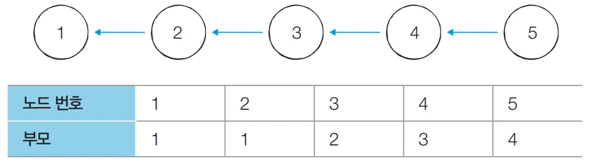

## 경로 압축
- 찾기 함수를 최적화하기 위한 방법으로 경로 압축(Path Compression)을 이용
  - 찾기 함수를 재귀적으로 호춣한 뒤에 <U>부모 테이블 값을 바로 갱신</U>

```python
# 특정 원소가 속한 집합을 찾기
def find_parent(parent, x):
  # 루트 노드가 아니라면, 루트 노드를 찾을 때까지 재귀적으로 호출
  if parent[x] != x:
    parent[x] = find_parent(parent, x)
  return parent[x]
```

- 경로 압축 기법을 적용하면 각 노드에 대하여 찾기 함수를 호출한 이후에 해당 노드의 루트 노드가 바로 부모 노드가 됨
- 동일한 예시에 대해 모든 합집합 함수를 처리한 후 각 원소에 대하여 찾기 함수를 수행하면 다음과 같이 부모테이블이 갱신됨

- 기본 방법에 비해 시간 복잡도가 개선됨

## 경로 압축 코드
```python
# 특정 원소가 속한 집합을 찾기
def find_parent(parent, x):
  # 루트 노드를 찾을 때까지 재귀 호출
  if parent[x] != x:
    parent[x] = find_parent(parent, x)
  return parent[x]

# 두 원소가 속한 집합을 합치기 
def union_parent(parent, a, b):
  a = find_parent(parent, a)
  b = find_parent(parent, b):
  if a < b:
    parent[b] = a
  else:
    parent[a] = b
# 노드의 개수와 간선(Union 연산)의 개수 입력 받기
v, e =map(int, input().split())
parent = [0] * (v + 1) # 부모 테이블 초기화하기

# 부모 테이블상에서, 부모를 자기 자신으로 초기화
for i in range(1, v + 1):
  parent[i] = i

# Union 연산을 각각 수행
for i in range(e):
  a, b = map(int, input().split())
  union_parent(parent, a, b)

# 각 원소가 속한 집합 출력하기
print('각 원소가 속한 집합: ', end='')
for i in range(1, v + 1):
  print(find_parent(parent, i), end=' ')

print()

# 부모 테이블 내용 출력하기
print('부모 테이블: ', end='')
for i in range(1, v + 1):
  print(parent[i], end=' ')
```

## 서로소 집합을 활용한 사이클 판별
- 무방향 그래프 내에서 사이클을 판별할 때 서로소 집합 사용 가능
  - 방향 그래프 내에서 사이클을 판별은 DFS

- 사이클 판별 알고리즘
  1. 각 간선을 하나씩 확인하며 두 노드의 루트 노드를 확인
    1. 루트 노드가 서로 다르다면 두 노드에 대하여 합집합 연산을 수행
    2. 루트 노드가 서로 같다면 사이클이 발생한 것
  2. 그래프에 포함되어 있는 모든 간선에 대해 1번 과정 반복

## 동작 과정
0. 모든 노드에 대해 자기 자신을 부모로 설정하는 형태로 부모 테이블을 초기화
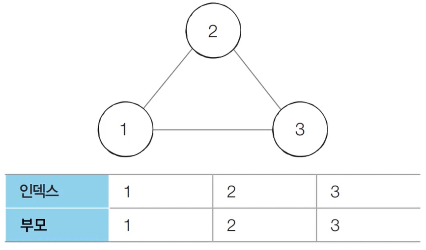
1. 간선(1,2)을 확인. 노드 1과 노드 2의 루트 노드는 각각 1과 2. 따라서 더 큰 번호에 해당하는 노드 2의 부모 노드를 1로 변경
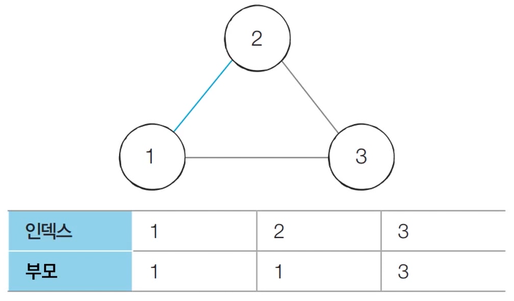
2. 간선(1,3)을 확인. 노드 1과 노드 3의 루트 노드는 각각 1과 3. 따라서 더 큰 번호에 해당하는 노드 3의 부모 노드를 1로 변경
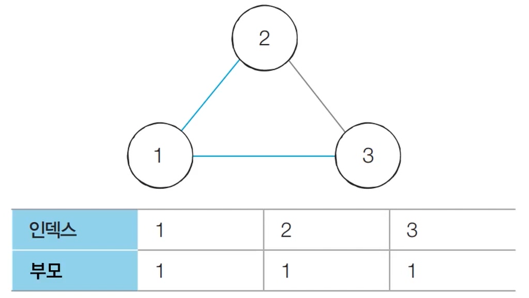
3. 간선(2,3)을 확인. 노드 1과 노드 3의 루트 노드는 모두 1. **사이클 발생**을 확인
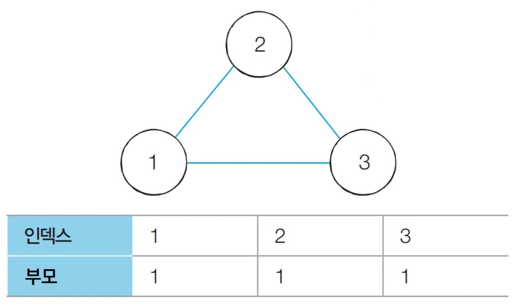

```python
# 특정 원소가 속한 집합을 찾기
def find_parent(parent, x):
    # 루트 노드가 아니라면, 루트 노드를 찾을 때까지 재귀적으로 호출
    if parent[x] != x:
        parent[x] = find_parent(parent, parent[x])
    return parent[x]

# 두 원소가 속한 집합을 합치기
def union_parent(parent, a, b):
    a = find_parent(parent, a)
    b = find_parent(parent, b)
    if a < b:
        parent[b] = a
    else:
        parent[a] = b

# 노드의 개수와 간선(Union 연산)의 개수 입력 받기
v, e = map(int, input().split())
parent = [0] * (v + 1) # 부모 테이블 초기화하기

# 부모 테이블상에서, 부모를 자기 자신으로 초기화
for i in range(1, v + 1):
    parent[i] = i

cycle = False # 사이클 발생 여부

for i in range(e):
    a, b = map(int, input().split())
    # 사이클이 발생한 경우 종료
    if find_parent(parent, a) == find_parent(parent, b):
        cycle = True
        break
    # 사이클이 발생하지 않았다면 합집합(Union) 연산 수행
    else:
        union_parent(parent, a, b)

if cycle:
    print("사이클이 발생했습니다.")
else:
    print("사이클이 발생하지 않았습니다.")
```