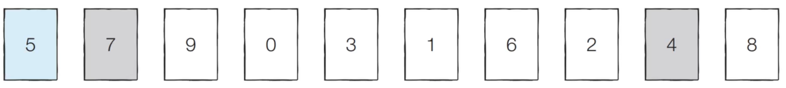
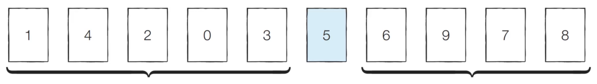
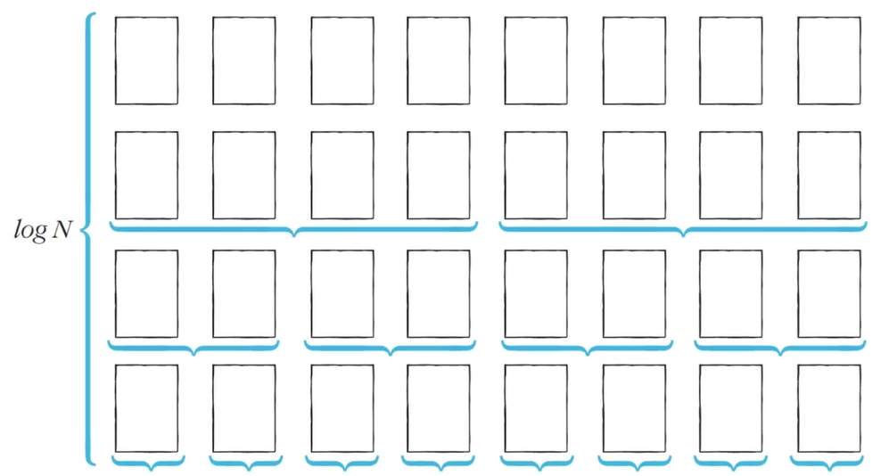

# 퀵 정렬
- 기준 데이터를 설정하고 그 기준보다 큰 데이터와 작은 데이터의 위치를 바꾸는 방법
- 일반적인 상황에서 가장 많이 사용되는 정렬 알고리즘
- 병합 정렬과 더불어 대부분의 프로그래밍 언어의 정렬 라이브러리의 근간이 되는 알고리즘
- 가장 기본적인 퀵 정렬은 첫 번째 데이터를 기준 데이터(Pivot)로 설정

## 동작 예시

- 피벗의 값은 5
- 왼쪽에서 5보다 큰 데이터를 선택 : 7
- 오른쪽에서 5보다 작은 데이터 선택 : 4
- 두 데이터의 위치 변경
- 반복
- 위치가 엇갈리는 경우 피벗과 작은 데이터의 위치를 변경

- 5의 왼쪽에 있는 데이터는 모두 5보다 작음
- 5의 오른쪽에 있는 데이터는 모두 5보다 큼
- 분할 : 피벗을 기준으로 데이터 묶음을 나누는 작업
- 왼쪽과 오른쪽에 있는 데이터들에 퀵정렬 수행

## 퀵 정렬이 빠른 이유
- 이상적인 경우 분할이 절반씩 일어난다면 전체 연산 횟수로 O(NlogN)을 기대
  - 너비 x 높이 = N x logN = NlogN
  