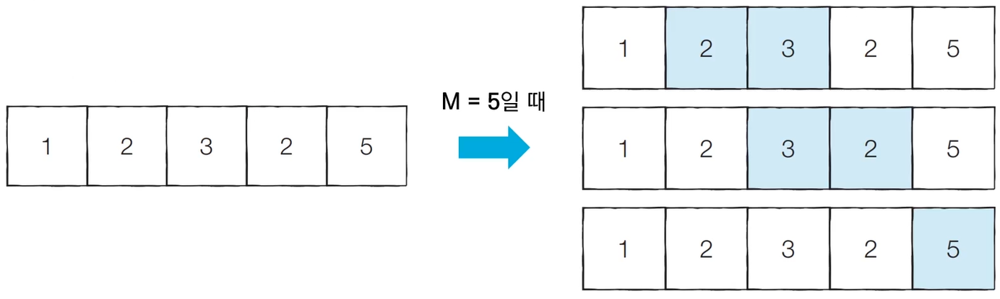
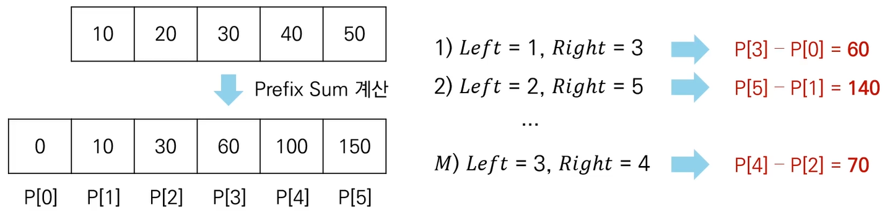

# 투 포인터(Two Pointers)
- **리스트에 순차적으로 접근해야 할 때 두 개의 점의 위치를 기록하면서 처리**하는 알고리즘
- 흔히 2,3,4,5,6,7번 학생을 지목할 때 간단히 '2번부터 7번까지의 학생'이라고 함
- 리스트에 담긴 데이터에 순차적으로 접근해야 할 때는 **시작점**과 **끝점** 2개의 점으로 접근할 데이터의 범위를 표현할 수 있음

## 특정한 합을 가지는 부분 연속 수열 찾기
- N개의 자연수로 구성된 수열
- 합이 M인 부분 연속 수열의 개수를 구해보세요
- 수행 시간 제한은 O(N)

- 투 포인터를 활용하여 다음과 같은 알고리즘으로 문제를 해결 할 수 있음
1. 시작점과 끝점이 첫 번째 원소의 인덱스를 가리키도록 한다.
2. 현재 부분합이 M과 같다면, 카운트한다.
3. 현재 부분합이 M보다 작다면, end를 1 증가시킨다.
4. 현재 부분 합이 M보다 크거나 같다면, start를 1 증가시킨다.
5. 모든 경우를 확인할 때까지 2번부터 4번까지의 과정을 반복한다.
```python
n = 5 # 데이터의 개수 N
m = 5 # 찾고자 하는 부분합 M
data = [1, 2, 3, 2, 5] # 전체 수열

count = 0
interval_sum = 0
end = 0

# start를 차례대로 증가시키며 반복
for start in range(n):
    # end를 가능한 만큼 이동시키기
    while interval_sum < m and end < n:
        interval_sum += data[end]
        end += 1
    # 부분합이 m일 때 카운트 증가
    if interval_sum == m:
        count += 1
    interval_sum -= data[start]

print(count)
```

## 구간 합(Interval Sum)
- 구간 합 문제 : 연속적으로 나열된 N개의 수가 있을 때 <u>특정 구간의 모든 수를 합한 값을 계산</u>하는 문제
- 예를 들어 5개의 데이터로 구성된 수열 {10,20,30,40,50}이 있으면
  - 두 번째 수부터 네 번째 수까지의 합은 20 + 30 + 40  = 90

## 구간 합 빠르게 계산하기
- N개의 정수로 구성된 수열
- M 개의 쿼리 정보가 주어짐
  - 각 쿼리는 Left와 Right로 구성됨
  - 각 쿼리에 대하여 [Left, Right] 구간에 포함된 데이터들의 합을 출력해야 함
- 수행 시간 제한은 O(N + M)

- 접두사 합(Prefix Sum) : 배열의 맨 앞부터 특정 위치까지의 합을 미리 구해 놓은 것
- 접두사 합을 활용한 알고리즘
  - N개의 수 위치 각각에 대하여 접두사 합을 계산하여 P에 저장
  - 매 M개의 쿼리 정보를 확인할 때 구간 합은 P[Right] - P[Left -1]
  
```python
# 데이터의 개수 N과 전체 데이터 선언
n = 5
data = [10, 20, 30, 40, 50]

# 접두사 합(Prefix Sum) 배열 계산
sum_value = 0
prefix_sum = [0]
for i in data:
    sum_value += i
    prefix_sum.append(sum_value)

# 구간 합 계산 (세 번째 수부터 네 번째 수까지)
left = 3
right = 4
print(prefix_sum[right] - prefix_sum[left - 1])
```