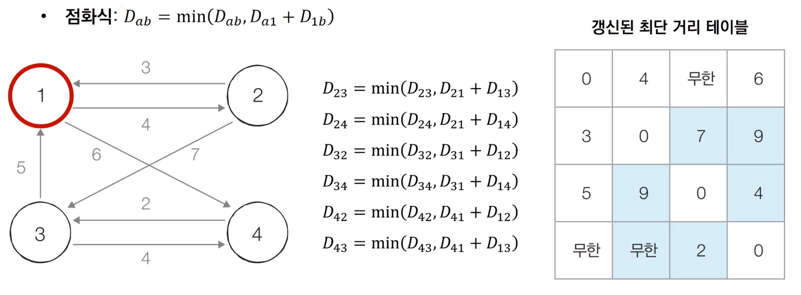
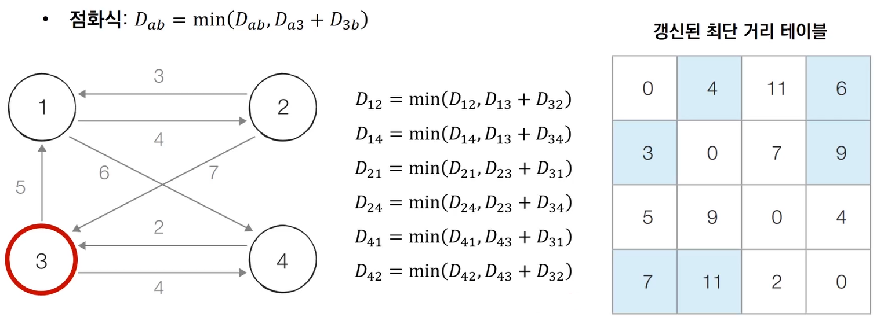

# 플로이드 워셜
## 개요
- <U>모든 노드에서 다른 모든 노드까지의 최단 경로를 모두 계산</U>
- 플로이드 워셜 알고리즘은 다익스트라 알고리즘과 마찬가지로 단계별로 거쳐 가는 노드를 기준으로 알고리즘을 수행
  - 다만 매 단계마다 방문하지 않은 노드 중에 최단 거리를 갖는 노드를 찾는 과정이 필요하지 않음
- 2차원 테이블에 최단 거리 정보를 저장
- 다이나믹 프로그래밍 유형에 속함
- 각 단계마다 **특정한 노드 k를 거쳐 가는 경우를 확인**
  - a에서 b로 가는 최단 거리보다 a에서 k를 거쳐 b로 가는 거리가 더 짧은지 검사
- 점화식


## 동작 과정
0. 그래프를 준비하고 최단 거리 테이블을 초기화

1. 1번 노드를 거쳐 가는 경우를 고려하여 테이블을 갱신

2. 2번 노드를 거쳐 가는 경우를 고려하여 테이블을 갱신

3. 3번 노드를 거쳐 가는 경우를 고려하여 테이블을 갱신

4. 4번 노드를 거쳐 가는 경우를 고려하여 테이블을 갱신


## 코드
```python
INF = int(1e9) # 무한을 의미하는 값으로 10억을 설정

# 노드의 개수 및 간선의 개수를 입력받기
n = int(input())
m = int(input())
# 2차원 리스트(그래프 표현)을 만들고, 무한으로 초기화
graph = [[INF] * (n +1) for _ in range(n+1)]

# 자기 자신에서 자기 자신으로 가는 비용은 0으로 초기화
for a in range(1, n+1):
  for b in rnage(1, n+1):
    if a == b:
      graph[a][b] = 0

# 각 간선에 대한 정보를 입력 받아, 그 값으로 초기화
for _ in range(m):
  # A에서 B로 가는 비용은 C라고 설정
  a, b, c = map(int, input().split())
  graph[a][b] = c

# 점화식에 따라 플로이드 워셜 알고리즘을 수행
for k in range(1, n+1):
  for a in range(1, n + 1):
    for b in range(1, n + 1):
      graph[a][b] = min(graph[a][b], graph[a][k] + graph[k][b])
# 수행된 결과를 출력
for a in range(1, n+1):
  for b in range(1, n+1):
    # 도달할 수 없는 경우, 무한(INFINITY)이라고 출력
    if graph[a][b] == INF:
      pirnt('INFINITY', end=' ')
    # 도달할 수 있는 경우 거리를 출력
    else:
      print(graph[a][b], end=' ')
  print()
```

## 성능 분석
- 노드의 개수가 N개일 때 알고리즘 상으로 N번의 단계를 수행
  - 각 단계마다 O(N^2)의 연산을 통해 현재 노드를 거쳐 가는 모든 경로를 고려
- 총 시간 복잡도 O(N^3)
- 노드의 개수가 500개 이하인 경우
- 또한 500^3은 1억이 넘으므로 시간이 넉넉하지 않은 경우 시간초과가 발생할 수 있음